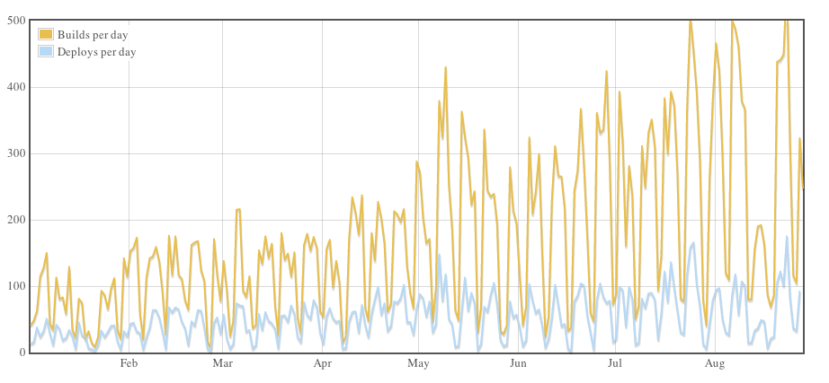

## think about process

>**Robert Whiting** {dev team lead}

---

## contents
* what is process?
* piles of badness
* case studies
* distilled goodness

---

## it's so vague
* **what is process?**
* piles of badness
* case studies
* distilled goodness

----

#### typical process
> a series of actions in order to achieve a particular end

note:
- anything can be a typical process, getting here

----

#### good process
> a repeatable set of actions that multiplies effectiveness

---

## process abuse
* what is process?
* **piles of badness**
* case studies
* distilled goodness

----

## process over people

<!-- .element height="500px" .element style="border: 0; background: None; box-shadow: None" -->

note:
- people solve problems, not processes
- over standardization/sanitization signals lack of humanity

----

## not getting work done

<!-- .element style="border: 0; background: None; box-shadow: None" -->

note:
- if you're doing process, you're not getting work done
- it's easy to over-analyze and spend all your time building processes and not doing them
- **multiplying** by negative or 0

---

## the fun part
* what is process?
* piles of badness
* **case studies**
* distilled goodness

----

<!-- .element height="200px" .element style="border: 0; background: None; box-shadow: None" -->
note:
- hiring
- **think about process don't implement this**

----

<!-- .element height="200px" .element style="border: 0; background: None; box-shadow: None" -->
note:
- deployment
- **think about process don't implement this**

----

<!-- .element height="200px" .element style="border: 0; background: None; box-shadow: None" -->
note:
- fulfilment
- **think about process don't implement this**

---

<!-- .element height="200px" .element style="border: 0; background: None; box-shadow: None" -->

* what is process?
* piles of badness
* **case studies 1/3**
* distilled goodness

----

### the process
a set of lessons learned and guiding principles

<!-- .element height="300px" .element style="border: 0; background: None; box-shadow: None" -->

note:
- Work Rules! by Lazlo Bock

----

### research based

----

> Unstructured interviews can explain only 14 percent of an employee’s future performance.

note:
- best predictor is a work sample test (29 percent)
- second-best predictors are tests of general cognitive ability (26 percent)
  - IQ test
  - capacity to learn
  - raw intelligence
  - but remove bias from standardized tests

----

### remove biases
note:
- manager has little to no decision in hiring
- interviews include non-interested parties
- using a standard rubric

----

### measured & repeatable
note:
- notes taken on questions and responses
- boring questions with brilliant responses

----

> Tell me about a time your behavior had a positive impact on your team.

note: (Follow-ups: What was your primary goal and why? How did your teammates respond? Moving forward, what’s your plan?)

----

### constant improvement
note:
- full access to prior reviews, q&a, and hire rate
- interviewers reviewed on effectiveness
- research affects change

---

<!-- .element height="200px" .element style="border: 0; background: None; box-shadow: None" -->

* what is process?
* piles of badness
* **case studies 2/3**
* distilled goodness

----

### the why
note:
>Developers and designers are responsible for shipping new stuff themselves as soon as it's ready. This means that deploying needs to be as smooth and safe a process as possible.

----

### the process
a simple list of steps

----

### the steps
1. push changes to a branch
* wait for the build to pass
* tell Hubot to deploy it
* verify that the changes work (fix problems)
* merge the branch into master

note:
What now?
- considered stable after 15 minutes in production
- monitor exceptions, performance, tweets, and do any extra verification
- rolling back to master only takes 30 seconds.

Hubot was created by Github as a tool to dramatically improve employee efficiency

----

### the result

<!-- .element style="border: 0; background: None; box-shadow: None" -->

----

### nothing extra
note:
- devoid of waste
- no unnecessary steps
- no extra hand-overs

----

### bought in
note: understood, communicated, bought in

----

### measured and updated
note:
- additions to rollback scripts
- best practices for compatibility
- robust automated testing

----

### effective
note:
- one of the most trusted places to keep code
- 69+ million Projects hosted

---

<!-- .element height="200px" .element style="border: 0; background: None; box-shadow: None" -->

* what is process?
* piles of badness
* **case studies 3/3**
* distilled goodness

----

### the process
reduce human error with physical layout

----

### inbound dock

<!-- .element height="500px" .element style="border: 0; background: None; box-shadow: None" -->
note:
- inspection for inbound damage
- labeling

----

### randomized shelving

<!-- .element height="500px" .element style="border: 0; background: None; box-shadow: None" -->
note:
- yellow bins (incoming)
- reduce human error for similar things
- Star Wars DVD might be next to a box of Lego

----

### shopping

<!-- .element height="500px" .element style="border: 0; background: None; box-shadow: None" -->
note:
- optimized routing for shoppers
- orange bins (outgoing)

----

### packaging

<!-- .element height="500px" .element style="border: 0; background: None; box-shadow: None" -->
note:
- scanned for size/shape
- combined box optimization (look for c4, c2 on boxes)

----

### labeling

<!-- .element height="500px" .element style="border: 0; background: None; box-shadow: None" -->
note:
- verified via weight & barcode
- shipping label "slammed on"

----

### shipping

<!-- .element height="500px" .element style="border: 0; background: None; box-shadow: None" -->
note:
- optimize based on delivery company pickup times

----

### effective
note:
- optimized
- no wasted repetition

----

### usable
note:
- easy to understand
- has buy-in and commitment to use it
- built on time-tested best practice processes

----

### measured & updated
note:
- measured and updated for defect removal and speed
- quality assurance and improvements cycles

---

## the important part
* what is process?
* piles of badness
* case studies
* **distilled goodness**

note:
- set of principles, list, physical layout
- make it your own

----

## effective
note:
- all 3 cases
- must do what it is supposed to
- sufficiently important
- contributes positively to the immediate process group
- contributes to achieving the business objectives
  - usable and it meets current requirements

----

## documented
note:
- all 3 cases
- process becomes tribal knowledge without it
- easier to pass on the whole accurate process
- standardization

----

## bought in
note:
- all 3 cases
- users of the process need to understand it
- has users’ buy-in and commitment to use it

----

## improving
note:
- all 3 cases
- **measurable and actually measured**
- controlled processes can be improved if it is consistently executed
- built on previously designed and tested best practice processes
- subject to constant reviews
- quality assurance and improvements cycles

----

## simple
note:
- Github & Amazon, not Google
- simple process are less error prone
- unnecessary complexity makes it hard to control/measure/execute
- easy to trace execution
- obvious: outside observers should see the value and natural progression
- devoid of waste
- few hand-overs
- easy to understand by the different people

---

### good process
> a repeatable set of actions that multiplies effectiveness

----

## think about process

note:
- make it your own **multiply effectiveness**
- deploy process, meetings, api changes, project planning, testing, code reviews
- How to Team groups
- "if nothing else, take a few minutes alone in a chair to **think about process**"

---

### read it yourself

* [industry-week](http://www.industryweek.com/continuous-improvement/six-easy-criteria-targeting-good-process)
* [it.toolbox](http://it.toolbox.com/blogs/deliberate-dev/what-makes-a-good-process-17308)
* [bpmleader]( http://www.bpmleader.com/2013/10/23/the-difference-between-a-good-and-bad-process/)
* [quantmleap](http://quantmleap.com/blog/2011/05/good-process-bad-process-and-everything-in-between/)
* [fastcompany](https://www.fastcompany.com/1837301/5-ways-process-killing-your-productivity)
* [wired-google](https://www.wired.com/2015/04/hire-like-google/)
* [workrules](http://a.co/77MMGiH)
* [github-deploy](https://github.com/blog/1241-deploying-at-github)
* [amazon-shipping](http://www.pocket-lint.com/news/118513-inside-amazon-fulfilment-centre)
